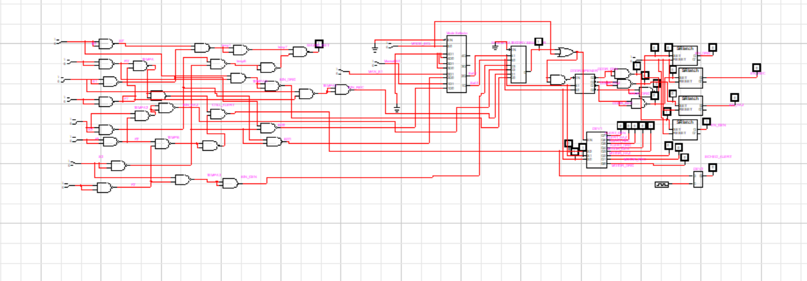
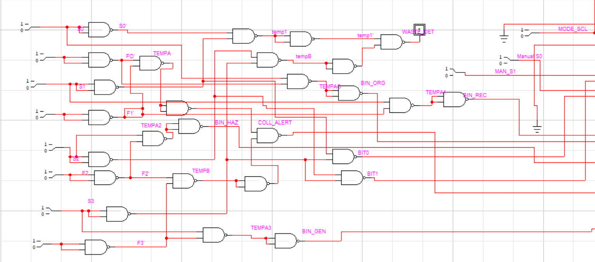
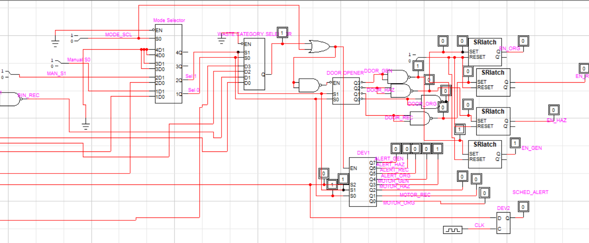
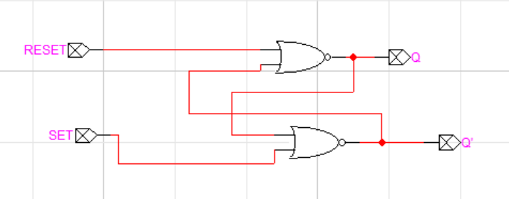

#  🗑️ Smart-Waste-Management-System
Smart Waste management system simulation in LogicWorks using combinational logic for automated based segregation and bin control
Smart Waste Segregation and Bin Management System is a combinational and sequential logic circuit developed as part of a **Digital Logic Design (DLD)** lab project in semester 02 of BS Software Engineering.
The project is inspired by real-world smart city waste management and implements core digital logic concepts such as gate logic, multiplexing, decoding, latching and flip-flop timing  all built from scratch using **standard 74-series ICs in LogicWorks**.
## ⚙️ System Features:
- 🔹 **4 waste categories** — Organic, Recyclable, Hazardous, General
- 🔹 **Automatic mode** driven by binary sensors
- 🔹 **Manual override mode** for operator control
- 🔹 **SR NOR Latch** custom-built from scratch (IC unavailable in LogicWorks)
- 🔹 **Bin door memory** — door stays open until deposit is confirmed
- 🔹 **Fill level detection** with indicator LEDs per bin
- 🔹 **Collection alert** fires automatically when any bin is full
- 🔹 **Scheduled alert** generated via D Flip-Flop on clock edge
- 🔹 **Motor control** for each bin via 3x8 Decoder
- 🔹 **8-bit output register** showing live bin and alert status
## 🛠️ Components Used
- **Simulation Tool:** LogicWorks 5
- **Language / Standard:** 74-series TTL ICs
- **Concepts:**
  - Universal gate logic (NAND/NOR)
  - Multiplexers (2x1 and 4x1)
  - Decoders (2x4 and 3x8)
  - SR NOR Latch (custom-designed)
  - D Flip-Flop timing
  - State machines
  - Combinational and sequential circuit design
## 🧠 Learning Outcomes
This project helped us strengthen our understanding of:
- Core digital logic design concepts
- Building memory elements from basic gates
- Sequential vs combinational circuit behaviour
- Structuring a large multi-block circuit in LogicWorks
- Team collaboration and version control using GitHub
## 👥 Team Members:
-Rabiya Rana
-Javeria Yasin 
## 🔌 Inputs & Outputs
**Inputs:**
| Signal | Description |
|---|---|
| S0 | Organic waste sensor — HIGH when organic waste detected |
| S1 | Recyclable waste sensor — HIGH when recyclable waste detected |
| S2 | Hazardous waste sensor — HIGH when hazardous waste detected |
| S3 | General waste sensor — HIGH when general waste detected |
| F0–F3 | Fill level sensors — one per bin |
| M | Mode switch — 0 = Auto, 1 = Manual |
| C1, C0 | Manual category select bits |
| DEPOSIT_DONE | Confirms waste dropped in — resets SR latch |
| CLK | System clock for D Flip-Flop |
**Outputs:**
| Signal | Description |
|---|---|
| DOOR_ORG / REC / HAZ / GEN | Opens correct bin door |
| MOTOR_ORG / REC / HAZ / GEN | Runs motor for that bin |
| ALERT_ORG / REC / HAZ / GEN | Lights up when that bin is full |
| COLL_ALERT | Fires when any bin reaches full capacity |
| SCHED_ALERT | Scheduled collection alert via D Flip-Flop |
## 🔁 Signal Flow
Sensors (S0–S3)
      ↓
NAND/NOR Logic Block → WASTE_DET, COLL_ALERT, BIT0, BIT1
      ↓
2x1 MUX (IC 74157) → Auto or Manual mode selected
      ↓
4x1 MUX (IC 74153) → Active waste category chosen
      ↓
2x4 Decoder (IC 74139) → One bin door opens
      ↓
SR NOR Latch (x4) → Holds door open until DEPOSIT_DONE
      ↓
D Flip-Flop (IC 7474) → Captures fill state on clock edge → SCHED_ALERT
      ↓
3x8 Decoder (IC 74138) → Motors, Fill LEDs, Collection Alert
## 📋 Truth Tables
### Sensor → Bin Selection
| S0 | S1 | S2 | S3 | BIN0 (Org) | BIN1 (Rec) | BIN2 (Haz) | BIN3 (Gen) |
|---|---|---|---|---|---|---|---|
| 0 | 0 | 0 | 0 | 0 | 0 | 0 | 0 |
| 1 | 0 | 0 | 0 | 1 | 0 | 0 | 0 |
| 0 | 1 | 0 | 0 | 0 | 1 | 0 | 0 |
| 0 | 0 | 1 | 0 | 0 | 0 | 1 | 0 |
| 0 | 0 | 0 | 1 | 0 | 0 | 0 | 1 |

### SR NOR Latch (Bin Door Memory)
| S (Set) | R (Reset) | Q (Bin Open) | What Happens |
|---|---|---|---|
| 0 | 0 | Last Q| No change — door stays as is |
| 1 | 0 | 1 | Door opens — waste detected |
| 0 | 1 | 0 | Door closes — deposit confirmed |
| 1 | 1 | X | Invalid — prevented by design |
### Mode Selection (2x1 MUX)
| M | Selected Output | Mode |
|---|---|---|
| 0 | Auto sensor signal | Automatic |
| 1 | Manual C1, C0 | Manual override |
## 🖼️ Circuit Diagrams
### Full Circuit Schematic

### Input Logic & Mode Selection Block

### Memory Latches & Output Control Block

### Custom SR NOR Latch (built from scratch)

## ✅ Test Results
All 7 test cases verified in LogicWorks simulation:
| Test | Input | Expected Output | Result |
|---|---|---|---|
| No waste | All sensors = 0 | IDLE, all doors closed | ✅ Pass |
| Organic waste | S0 = 1 | BIN0 opens, Motor M0 ON | ✅ Pass |
| Recyclable waste | S1 = 1 | BIN1 opens, Motor M1 ON | ✅ Pass |
| Hazardous waste | S2 = 1 | BIN2 opens, Motor M2 ON | ✅ Pass |
| Bin full | Fill sensor = 1 | LED ON, COLL_ALERT fires | ✅ Pass |
| Manual override | M = 1 | C1, C0 controls bin directly | ✅ Pass |
| SR Latch memory | Sensor off mid-drop | Door stays open until DEPOSIT_DONE | ✅ Pass |
## ▶️ How to Open the Circuit
1. Make sure **LogicWorks 5** is properly installed on your system.
2. Clone the repository:https:
3. //github.com/RabiyaRana/Smart-Waste-Management-System.git
4. Open `circuits/smart-waste-segregation.cct` in LogicWorks
5. Use the toggle switches on the left to simulate sensor inputs
6. Flip `M` to switch between automatic and manual mode
7. Press `DEPOSIT_DONE` after waste drops to reset the SR latch and close the door
## 📂 Repository Structure
📁 smart-waste-segregation/
├── 📄 README.md
├── 📁 circuits/
│   ├── smart-waste-segregation.cct   ← main circuit
│   └── sr-nor-latch.cct              ← custom SR NOR latch
└── 📁 images/
    ├── main-circuit-overview.png
    ├── input-logic-block.png
    ├── output-logic-block.png
    └── sr-nor-latch.png
## 📚 References
- Mano & Ciletti — *Digital Design: With an Introduction to the Verilog HDL*, Pearson, 2013
- Floyd — *Digital Fundamentals*, 11th ed., Pearson, 2015
- Texas Instruments Datasheets: IC 74153, 74138, 74157, 7474
- LogicWorks 5 User Manual, Capilano Computing Systems, 2002
